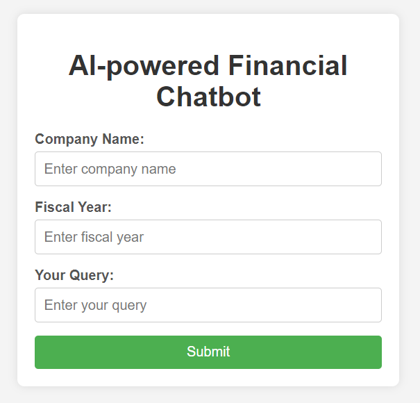
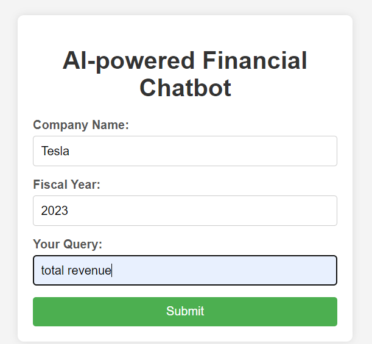
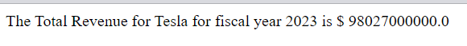

# AI-Powered Financial Chatbot Documentation

Interface:

## Overview
The financial chatbot is designed to assist users by providing financial metrics for specific companies based on predefined queries. The chatbot uses financial data from recent fiscal years to deliver accurate and relevant information in response to user requests.

## How It Works
Users interact with the chatbot by submitting predefined queries through a web page interface. These queries can request information on key financial metrics such as total revenue, net income, assets, liabilities, and cash flow. The chatbot processes the query by extracting the requested data for the specified company and fiscal year from its dataset. The response is then formatted and presented to the user directly on the webpage.
Input:

Output:

## Predefined Queries
The chatbot can respond to the following queries only:

1. total revenue
2. net income
3. sum of total assets
4. sum of total liabilities
5. cash flow from operating activities
6. revenue growth(%)
7. net income growth(%)
8. assets growth(%)
9. liabilities growth(%)
10. cash flow from operations growth(%)
11. year by year average revenue growth rate(%)
12. year by year average net income growth rate(%)
13. year by year average assets growth rate(%)
14. year by year average liabilities growth rate(%)
15. year by year average cash flow from operations growth rate(%)

## Data Analysis and Integration
The datasets used by the chatbot were analyzed and collected using the `edgar_analysis.ipynb` notebook. These datasets were then integrated into the chatbot through the `edgar_analysis_chatbot.ipynb` notebook and the `prototype3.py` script. 

## Webpage and User Guidance
An `index.html` file was created to design the webpage interface where users can interact with the chatbot. For user guidance, detailed instructions are available in the `user_guide.md` file.

## Limitations
- **Predefined Queries Only**: The chatbot can only respond to the specific queries listed above. It is not equipped to handle custom or unstructured queries.
- **Data Range**: The chatbot's responses are based on the available data, which covers specific companies and fiscal years. If the data is incomplete or not available for a given query, the chatbot may not be able to provide a response.
- **Company-Specific**: Users must specify the company they are inquiring about. The chatbot cannot compare data across multiple companies simultaneously.

## Platform
The chatbot is designed to operate seamlessly on a webpage, providing users with an easy-to-access and interactive platform for obtaining financial information.
